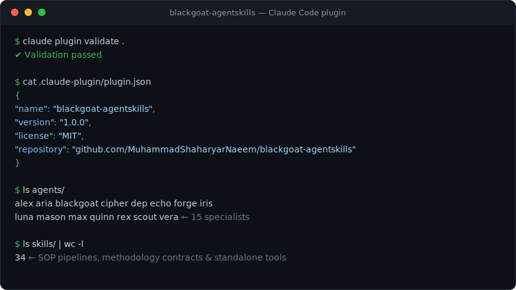
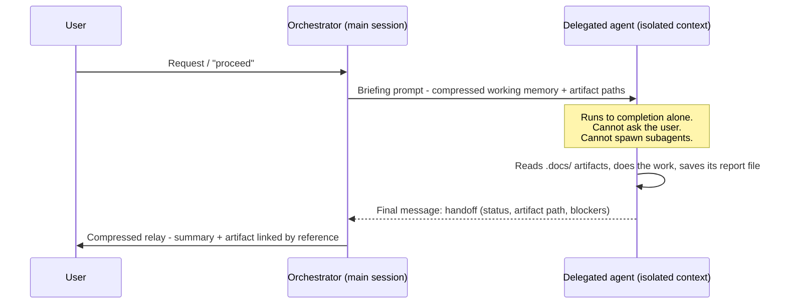
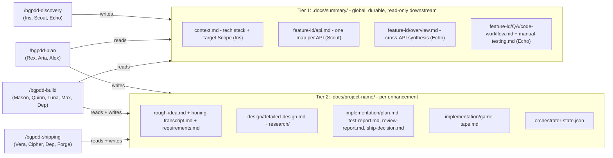
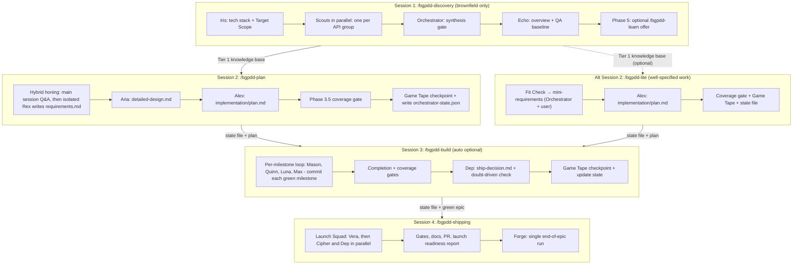
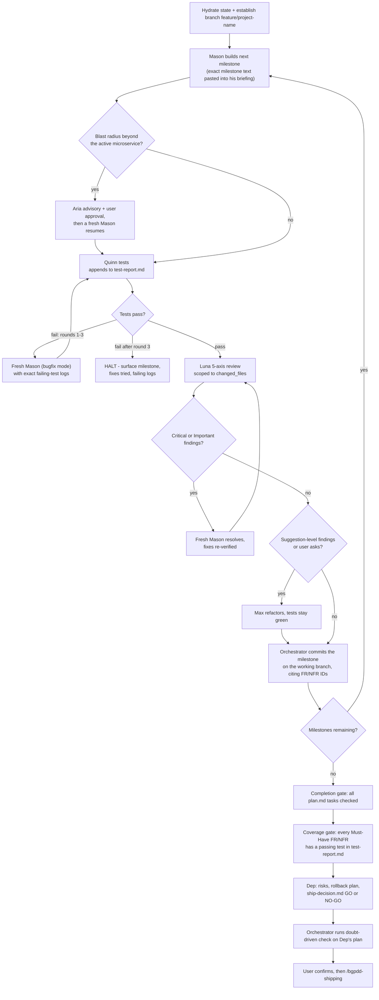
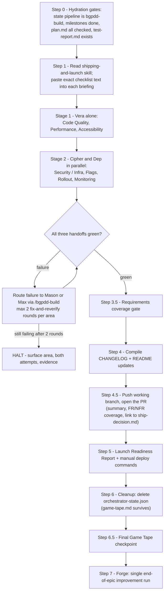
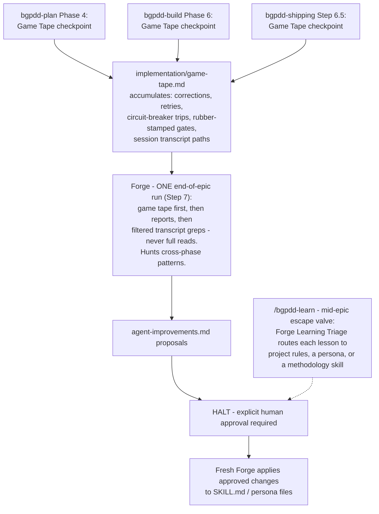

# Blackgoat Agent Skills

[](https://www.claudepluginhub.com/plugins/muhammadshaharyarnaeem-blackgoat-agentskills?ref=badge)

A Claude Code plugin that packages an **agent squad** and a **Prompt-Driven Development (PDD)** workflow into reusable skills and personas. An Orchestrator delegates self-contained tasks to specialized subagents, each of which runs in isolation and returns a structured `<handoff>`. Instead of one agent trying to hold an entire project in context, work is split across a squad of narrow specialists coordinated through slash-command SOPs — with requirement traceability enforced from the first honing question to the final pre-launch gate.

- **Plugin:** `blackgoat-agentskills` v1.1.0 — see [CHANGELOG.md](CHANGELOG.md)
- **Author:** shaharyar.naeem (shaharyar.naeem@gorelo.io)



---

## Start Here: You Don't Need the Whole System on Day One

The plugin is designed with a deliberate adoption gradient. Each step gives you value on its own; none requires the previous one.

**Step 1 — Fix one bug with `/bg-bugfix`.** One command, one bug, zero squad overhead. It walks a strict 5-phase sequence: root-cause analysis (no code edits allowed until the cause is stated), a failing test that *proves* the bug (TDD), the surgical fix, a blast-radius check on every consumer of what you touched, and finally an offer to route any systemic lesson through `/bgpdd-learn`. If you currently debug with ad-hoc prompts, this is the smallest possible taste of what disciplined gates feel like.

**Step 2 — Delegate one task to one agent.** Every squad member can be invoked ad hoc, at any project state: "have Luna review this diff", "have Cipher audit the auth routes", "have Quinn write tests for this module". The agent runs in isolation, does exactly its job, and returns a handoff. No pipeline required.

**Step 3 — Run `/bgpdd-lite` for well-specified work.** The mid-weight lane: no honing Q&A, no Aria — you write mini-requirements with the Orchestrator (Rex's template, stable FR/NFR IDs), Alex plans, the coverage gate checks traceability, and the state file hands off to `/bgpdd-build`. A five-question fit check up front routes anything contested or cross-boundary to the full pipeline instead.

**Step 4 — Run the full PDD pipeline** when a feature is big enough to warrant discovery, planning, staged building, and a gated launch. That's the rest of this README.

---

## Installation

Prerequisite: [Claude Code](https://docs.claude.com/en/docs/claude-code) installed.

**Option 1 — Claude Code marketplace (native).**

```
/plugin marketplace add MuhammadShaharyarNaeem/blackgoat-agentskills
/plugin install blackgoat-agentskills@blackgoat
```

**Option 2 — claudepluginhub.**

```bash
npx claudepluginhub muhammadshaharyarnaeem/blackgoat-agentskills
```

**Option 3 — Manual clone.**

```bash
git clone https://github.com/MuhammadShaharyarNaeem/blackgoat-agentskills ~/.claude/skills/blackgoat-agentskills
```

---

## Core Concepts

Four ideas underpin everything else in the plugin.

**1. Orchestrator-only delegation.** The Orchestrator (the `agent-squad` model, fronted by the Blackgoat persona) is the single point of contact with the user. It never builds, reviews, or tests anything itself — it understands what the user wants, delegates to the right specialist, reads the returned `<handoff>`, and relays a compressed summary back. This prevents "context collapse": one context window trying to hold requirements, design, code, tests, and review simultaneously.

**2. Subagent isolation.** A delegated agent runs to completion in its own bounded context. It **cannot pause to ask the user mid-task**, and it **cannot spawn further subagents**. Its `<handoff>` arrives as its final message; there is no messaging a running agent and no "kill" step. Consequence: any genuinely interactive step (like turn-by-turn requirements honing) must run in the main session, and all routing, re-delegation, and error recovery belong to the Orchestrator alone.

**3. Working-memory chunking.** The Orchestrator never passes full project history to an agent. Each briefing contains only the specific "Working Memory" chunk that agent needs — e.g., the exact text of one milestone from `plan.md`, or one checklist section pasted verbatim. Overloading a subagent's context causes downstream hallucination, so the SOPs forbid it explicitly.

**4. Artifacts by reference.** Agents save full reports to `.docs/` files; the Orchestrator keeps only a compressed summary (status, 2–3 key outputs, blockers) in active context and passes file *paths*, not file *contents*, to the next agent. The `.docs/` tree is the durable record; context windows are cache.



---

## The Two-Tier Memory Model

State lives on disk in two distinct scopes, and the pipelines are strict about who may write where.

**Tier 1 — `.docs/summary/`** is the *global* project knowledge base, produced **only** by `/bgpdd-discovery` and persisted across enhancement cycles. It is indexed by a durable feature id (`{feature}`, e.g. `slide`), so the next time that feature is touched, its map already exists. Every downstream pipeline treats Tier 1 as **read-only**.

**Tier 2 — `.docs/{project-name}/`** is the *per-enhancement* workspace (e.g. `slide-enhancement`), owned by plan/build/shipping. It holds this cycle's requirements, design, plan, reports, the accumulated `game-tape.md`, and `orchestrator-state.json` — the handoff state that lets a fresh chat session rehydrate mid-pipeline.



The rule is architectural, not stylistic: discovery agents must never write into a feature directory under Tier 2, and build/shipping must never write artifacts into Tier 1. Conflating the tiers would let one enhancement cycle corrupt the durable map every future cycle depends on.

---

## The Agent Squad

Every agent lives in `agents/<name>.md` with frontmatter declaring its `role`, `phase`, `model`, and `depends-on`, plus a **Methodology Dependencies** table naming exactly which skills it loads and when. Universal invariants (workspace isolation, `<handoff>` format, path resolution) live once in `skills/agent-squad/base-persona.md`; agents that need a different write boundary declare an inline override.

| Agent | Role | Model | Phase(s) |
|-------|------|-------|----------|
| **Blackgoat** | The Liminal Pragmatist — the human author's orchestration persona | main session | Orchestration (all phases) |
| **Iris** | System Architect (Discovery) — lightweight codebase discovery | haiku | Discovery |
| **Scout** | Research Scout — disposable deep-dive into one assigned API/repo | sonnet | Discovery (spawned in parallel, one per API group) |
| **Echo** | Legacy QA Analyst — reverse-engineers existing feature behavior | sonnet | Discovery |
| **Rex** | Requirements Analyst | sonnet | Plan — Phase 1 (Requirements) |
| **Aria** | System Architect | opus | Plan — Phase 2 (Architecture); Build advisor on blast-radius escalations |
| **Alex** | Strategist & Planner | opus | Plan — Phase 3 (Planning) |
| **Mason** | Builder | opus | Build — Phase 4 (Implementation) |
| **Quinn** | QA Tester — build-phase testing | sonnet | Build — Phase 5 (Testing) |
| **Luna** | Code Reviewer | sonnet | Build — Phase 6 (Code Review) |
| **Max** | Optimizer / Refactorer | sonnet | Build — Phase 7 (Refactoring, conditional) |
| **Vera** | Launch Verifier — pre-launch checklist verification | sonnet | Shipping — Phase 8 (Launch Verification) |
| **Cipher** | Security Auditor | sonnet | Shipping — Phase 8 (Security); Build [SEC]-milestone reviews |
| **Dep** | DevOps Engineer | sonnet | Build epic gate + Shipping — Phase 9 (Deployment) |
| **Forge** | Meta-Engineer / System Coach | opus | End of epic (bgpdd-shipping Step 7); `/bgpdd-learn` on demand — always human-approved |

Blurbs, in one line each: Iris scans repos and records the tech stack and Target Scope. Scout maps one feature's fragments inside one API and writes exactly one file. Echo reverse-engineers how an existing feature behaves today, from the Scouts' maps, before any requirements exist. Rex turns a honing transcript into an ID'd, testable spec. Aria designs the data model, contracts, and file structure (design only — a learned squad rule forbids delegating coding to the Architect). Alex converts the blueprint into a dependency-ordered task plan where every task cites the requirements it covers. Mason writes the code, TDD-first, inside a strict blast radius. Quinn proves the build-phase implementation works against the requirements. Luna reviews for correctness, readability, architecture, security, and performance without rewriting anything. Max refactors for clarity with tests staying green. Vera runs the pre-launch verification checklist against the finished codebase. Cipher hardens boundaries. Dep owns containers, CI/CD, rollback plans, and the GO/NO-GO verdict. Forge coaches the squad itself.

---

## The PDD Lifecycle

PDD runs as a chain of four slash-command SOPs. Each SOP is a *manager script*: it names which agents to spawn and in what order, but agents load their own methodology dependencies. **Each phase runs in its own fresh chat session** — the `.docs/` tree and `orchestrator-state.json` carry state across the session boundaries, and every phase transition inside a session waits for your explicit "proceed" (except build's opt-in auto mode).



Phase by phase:

- **`/bgpdd-discovery` (Phase 0)** — brownfield only. The Orchestrator establishes the Target Scope (repos, branch, local paths) up front, Iris writes `context.md`, you name the APIs holding the feature's fragments (the SOP hard-halts rather than hallucinate a list; a single Scout can run a footprint search if you don't know), Scouts fan out in parallel, and Echo synthesizes the cross-API overview plus a reverse-engineered QA baseline. Phase 5 offers an optional `/bgpdd-learn` run — discovery is global-tier and outside any epic, so no game tape exists to catch its lessons later.
- **`/bgpdd-plan` (Phase 1)** — has a brownfield Pre-Flight Check that halts if the Tier 1 knowledge base is missing. Honing is **hybrid**: the live one-question-at-a-time Q&A runs in the main session (a delegated agent can't pause to ask you things), then an isolated Rex synthesizes `requirements.md` from the transcript. Aria designs, Alex plans, the Phase 3.5 gate checks coverage, and Phase 4 writes the game tape and the state file.
- **`/bgpdd-lite` (Plan, lite)** — agents: Alex (+ Orchestrator mini-requirements). Produces `requirements.md`, `implementation/plan.md`, and `orchestrator-state.json` → hands off to `/bgpdd-build`. No honing, no Aria; the governing stack contract stands in for the blueprint, and the same coverage gate still applies.
- **`/bgpdd-build` (Phase 2)** — the milestone loop, detailed below.
- **`/bgpdd-shipping` (Phase 3)** — the Launch Squad, gates, PR, and the epic's single Forge run, detailed below.

### The state file

`orchestrator-state.json` has a defined schema so downstream pipelines hydrate deterministically:

```json
{
  "schema": 1,
  "project_name": "slide-enhancement",
  "feature": "slide",
  "pipeline": "bgpdd-plan",
  "branch": null,
  "phase_completed": 4,
  "milestone_cursor": null,
  "artifacts": {
    "requirements": ".docs/{project-name}/requirements.md",
    "design": ".docs/{project-name}/design/detailed-design.md",
    "plan": ".docs/{project-name}/implementation/plan.md"
  },
  "blockers": [],
  "updated": "<ISO-8601 timestamp>"
}
```

`feature` is the durable Tier 1 id (`null` for greenfield). `pipeline` records the last writer. `branch` and `milestone_cursor` are owned by build: the working branch established at hydration, and the next pending milestone. Shipping's Step 0 refuses to run if `pipeline` isn't `"bgpdd-build"` or milestones remain open, and its Step 6 deletes the file once the lifecycle completes — `game-tape.md` alone survives as the epic's durable record.

---

## Inside bgpdd-build: The Milestone Loop

At hydration, build reads the state file and **establishes a working branch** (asks for your naming convention, defaults to `feature/{project-name}`, never builds on main). Then it loops over milestones from `plan.md`:



Details worth knowing:

- **Blast radius rule.** Before touching any shared DTO or library, Mason must trace every consumer. If the radius crosses his microservice boundary, he documents it and returns — the Orchestrator brings in Aria as a temporary advisor, gets your approval on her recommendation, and re-delegates a fresh Mason with the ruling.
- **The rejection loop is bounded.** Mason-fix → Quinn-retest is capped at **3 rounds per milestone**. After round 3 the pipeline HALTs and surfaces everything rather than burn a fourth round on the same wall.
- **Every agent carries the circuit breaker.** Each delegation prompt includes verbatim: hit the exact same error 3 times in a row → stop, document, return. No fourth attempt.
- **The Orchestrator commits.** Each green milestone is committed on the working branch with a message citing the milestone and its FR/NFR IDs. (Committing is pipeline state management, not application coding — it doesn't violate the no-coding rule.) A worker that can't finish in one run commits its partial work before returning, so a fresh delegation can continue from disk.
- **Auto mode.** `/bgpdd-build auto` runs Build → Test → Review → Refactor per milestone without "proceed" prompts, but drops out and halts on circuit-breaker trips, and always stops for explicit approval before the epic-level Dep phase.

---

## Requirement Traceability: The Plugin's Spine

Every pipeline gate ultimately checks one chain: *requirement → design → task → test → launch*. IDs are assigned once and cited everywhere, so "done" is machine-checkable instead of vibes.

```mermaid
flowchart LR
    R["Rex: requirements.md<br/>stable FR/NFR IDs +<br/>Given/When/Then criteria"]
    A["Aria: detailed-design.md<br/>explicitly references<br/>the FR IDs it addresses"]
    X["Alex: plan.md<br/>every task carries a<br/>Requirements covered: field"]
    G1["Plan Phase 3.5 gate:<br/>every Must-Have ID maps<br/>to at least one task"]
    Q["Quinn: test-report.md<br/>tests exercising each ID"]
    G2["Build Phase 5 gate:<br/>every Must-Have ID has<br/>a passing test"]
    G3["Shipping Step 3.5 gate:<br/>re-verified before docs,<br/>PR, and launch"]
    R --> A --> X --> G1 --> Q --> G2 --> G3
```



The gates are enforced, not decorative: plan's Upgraded Chain-of-Thought checks *content contracts* (an artifact must satisfy its structural requirements, not merely exist), the Phase 3.5 gate re-delegates Alex on any uncovered Must-Have (bounded to 2 auto-fix rounds, then halt), build refuses to invoke Dep while any Must-Have lacks a passing test, and shipping blocks documentation and the PR on the same check. If a requirement silently disappears between planning and launch, three separate gates are positioned to catch it. All three now execute a deterministic script (`skills/pipeline-tools/scripts/check_coverage.py`) that returns a machine-readable uncovered-ID list, falling back to the manual read described above when no Python runtime exists.

---

## Shipping & the Launch Squad

`/bgpdd-shipping` is the final deployment gate. It runs a numbered checklist, in order, no skipping:



Why two stages instead of three parallel agents? Vera runs full builds and test suites that take file, build-output, and port locks; running scanners or infra verification concurrently against the same checkout causes lock collisions and flaky failures (especially on Windows). So Vera runs alone first, then Cipher and Dep launch in a single parallel batch. Dep compiles the Emergency Rollback Plan and his GO/NO-GO verdict into `ship-decision.md`. Any red area may be routed back through `/bgpdd-build` for a fix — at most **2 fix-and-reverify rounds per area** before the pipeline halts and hands you the evidence. If the `github-pr-review` skill is available, Step 4.5 also offers an automated multi-repo PR review pass.

---

## The Learning Loop

Earlier designs ran Forge at the end of every phase — which was structurally blind to cross-phase patterns, like a build failure whose real root cause was a planning gap. The current design collects evidence continuously and analyzes it once, when the whole epic is visible.



Each pipeline ends with a cheap, no-halt Orchestrator step: append at most 10 bullets of evidence to `game-tape.md` while the session's context is still alive. Forge reads that file *first* at epic end, then the durable reports, then — under a hard filtered-read rule — greps targeted slices of session transcripts (user messages, correction phrases, `<handoff>` blocks, error patterns) without ever full-reading one. Nothing he proposes is applied without your explicit approval.

When lessons shouldn't wait for the epic to ship — or when there is no epic at all, as in discovery's Phase 5 offer — **`/bgpdd-learn`** is the on-demand escape valve: same Forge, same approval gate, but the plan comes back inside his handoff and each lesson is triaged to the layer where it belongs.

---

## Skill Catalog

### SOP orchestrators (slash-command pipelines)
- **agent-squad** — the Orchestrator/delegation model itself; also home of `base-persona.md`, the one shared base persona
- **bgpdd-discovery** — global context discovery (Iris, Scout, Echo)
- **bgpdd-plan** — design & architecture (Rex, Aria, Alex)
- **bgpdd-lite** — mid-weight planning for well-specified work (Orchestrator mini-requirements + Alex; hands off to bgpdd-build)
- **bgpdd-build** — execution (Mason, Quinn, Luna, Max, Dep)
- **bgpdd-shipping** — verification & Launch Squad (Vera, Cipher, Dep, Forge)
- **bg-bugfix** — lean RCA → TDD → fix → blast-radius bugfix loop (no squad overhead)

### Methodology skills (execution contracts loaded by agents via their dependency tables)
- **blackgoat-idea-honing** — interactive requirements refinement (Rex / main session)
- **blackgoat-research** — codebase/tech research and system design (Aria)
- **planning-and-task-breakdown** — ordered, dependency-aware task lists (Alex)
- **test-driven-development** — RED/GREEN/REFACTOR worker contract (Mason, Quinn)
- **debugging-and-error-recovery** — root-cause debugging (Mason, Quinn)
- **source-driven-development** — ground decisions in official docs (Aria, Mason)
- **code-review-and-quality** — multi-axis review (Luna)
- **code-simplification** — behavior-preserving cleanup (Luna, Max)
- **performance-optimization** — profiling and bottleneck fixes (Luna, Max)
- **security-and-hardening** — vulnerability hardening (Cipher)
- **shipping-and-launch** — pre-launch checklist and rollout (Dep, Launch Squad)
- **playwright-skill** / **browser-testing-with-devtools** — real-browser E2E and DevTools testing (Quinn)
- **cloud-deploy-patterns** — provider-agnostic deploy baseline + AWS/Azure checklists (Dep, Cipher; conditional)
- **dotnet-backend-patterns** — .NET solution segregation, CQRS/REPR, EF Core rules (conditional, several agents)
- **vue3-spa-patterns** — Vue 3 Composition API, Pinia, Axios interceptor contract (conditional, several agents)
- **ui-design-patterns** — committed visual direction, typography/spacing/color/motion discipline, anti-generic-AI rules, and Luna's design-critique review axis (Aria, Mason, Luna; conditional on user-facing UI)
- **godot-gdscript-patterns** — Godot 4 GDScript patterns (conditional, several agents)

### Meta skills (operate on the plugin itself)
- **agent-audit** — audits personas/dependencies against 14 structural heuristics
- **agent-orchestration-improve-agent** — log parsing → procedural-memory generation (Forge's core methodology)
- **bgpdd-learn** — `/bgpdd-learn`, the on-demand session-learning triage (Orchestrator + Forge)
- **skill-creator** — scaffolds new CLI skills to Anthropic best practices

### Standalone tools
- **pipeline-tools** — deterministic coverage-gate CLI (`check_coverage.py`) executed by the Orchestrator at the bgpdd plan/build/shipping coverage gates; the manual check remains the fallback
- **doubt-driven-development** — adversarial fresh-context verification of decisions (run by the main-session Orchestrator, never by subagents)
- **spec-driven-development** — write a spec before coding
- **github-pr-review** — Linear-driven multi-repo PR review via GitHub MCP
- **prompt-engineering** — prompting patterns and optimization guidance

---

## Safety & Error Recovery

The plugin's failure doctrine is *halt and surface* — never guess, never silently bypass, never let a loop run unbounded.

- **Circuit breaker (every delegation).** Each agent's prompt includes verbatim: the exact same error 3 times in a row → stop, document what was tried and the exact error in the `<handoff>`, return immediately. No fourth attempt.
- **Bounded loops, everywhere a loop exists.** Build's Mason ↔ Quinn rejection loop: **3 rounds per milestone**. Plan's artifact auto-fix (e.g., Alex re-delegated on a coverage gap): **2 rounds per artifact**. Shipping's fix routing: **2 rounds per failing checklist area**. Hitting a bound always halts with the full evidence — the milestone, the attempts, the exact failing logs — instead of trying again.
- **Global error recovery.** A stuck tool-call loop, a hallucinated file path, or 3 consecutive failed attempts at an objective all trigger the same response: halt, output a structured state summary, request human intervention.
- **No watchdogs needed.** A delegated agent's context is bounded by its own run; it terminates when it returns. Workers that can't finish commit partial work to the working branch and describe the remainder in their handoff, and the Orchestrator re-delegates fresh.
- **Doubt-driven development.** Before high-stakes outputs reach you (e.g., Dep's ship decision at the end of build), the Orchestrator runs a fresh-context adversarial review over the artifact rather than trusting a confident first draft.

---

## MCP Servers

The plugin's `.mcp.json` wires up four MCP servers used by the testing, review, and shipping agents:

- **chrome-devtools-mcp** (`npx chrome-devtools-mcp@latest`) — DOM/console/network/perf inspection in a real browser
- **playwright** (`npx @playwright/mcp@latest`) — scripted end-to-end browser flows
- **linear-mcp-server** (`mcp-remote` → `https://mcp.linear.app/mcp`) — Linear issues/PR context (hosted, requires auth)
- **github-mcp-server** (`mcp-remote` → GitHub Copilot MCP endpoint) — GitHub operations for PR review; requires `GITHUB_PERSONAL_ACCESS_TOKEN`

---

## Usage Examples

- `/bg-bugfix` — fix a single bug end-to-end: root-cause analysis, a failing test that proves it, the surgical fix, and a blast-radius check. No squad, no pipeline.
- "have Luna review this diff" — delegate one task to one specialist ad hoc; Luna runs in isolation and returns a `<handoff>` with her findings.
- "have Quinn write tests for this module" — same ad-hoc delegation pattern, aimed at test coverage instead of review.
- `/bgpdd-lite` — the mid-weight lane for well-specified work: write mini-requirements with the Orchestrator, Alex plans, the coverage gate checks traceability, then hand off to build.
- `/bgpdd-plan` → `/bgpdd-build` → `/bgpdd-shipping` — the full pipeline for a feature big enough to warrant discovery, honing, architecture, staged building, and a gated launch, each run in its own fresh session.
- `/learn` — after a session with friction or a systemic lesson, route it through Forge's Learning Triage instead of letting it evaporate.

---

## Using the Plugin

1. **Brownfield? Run `/bgpdd-discovery` first** in its own session. Establish the Target Scope (repos, branch, paths), name the APIs when asked (or let a Scout search for the feature's footprint), and let the pipeline build the Tier 1 knowledge base under `.docs/summary/{feature}/`. Take the `/bgpdd-learn` offer at the end if the run had friction. Greenfield projects skip straight to planning.
2. **Run `/bgpdd-plan` in a fresh session.** Answer the honing questions one at a time — this Q&A runs in the main session because delegated agents can't ask you anything. Approve each phase transition; the pipeline ends by writing `game-tape.md` evidence and `orchestrator-state.json`. For well-specified work (a known pattern or contract), run **`/bgpdd-lite`** instead — its Fit Check confirms lite is appropriate, you draft mini-requirements with the Orchestrator, and Alex produces the same gated `plan.md` handoff without honing or architecture phases.
3. **Run `/bgpdd-build` in a fresh session** (add `auto` to skip per-phase confirmations). The pipeline hydrates from the state file, establishes the working branch (default `feature/{project-name}`), loops the milestones, and commits each green one. Expect halts, not heroics, when a bound is hit.
4. **Run `/bgpdd-shipping` in a fresh session.** The Launch Squad verifies, the gates check coverage, Step 4.5 opens the PR, and you get a Launch Readiness Report with the manual deploy commands — production deployment stays in your hands.
5. **Approve Forge's proposals** at Step 7 (or from any `/bgpdd-learn` run) before anything is applied. Review artifacts anytime under `.docs/{project-name}/` (this cycle's work) and `.docs/summary/` (the durable knowledge base).
